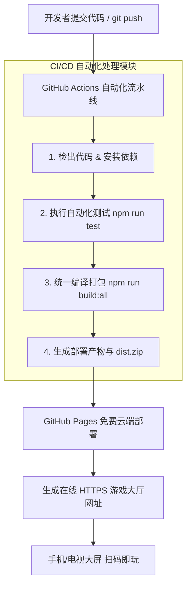

# 双游戏整合与 GitHub Actions CI/CD 免费云端自动部署设计方案

## 1. 核心目标
1. **游戏模块整合与优化**：
   - 整合 `fruit`（手势拍水果）与 `badminton-game`（双人羽毛球对战）两款游戏至统一导航大厅。
   - 引入标准化的摄像头/视频源选择器组件（支持 USB 摄像头、手机前后置摄像头及局域网视频流选择）。
2. **GitHub Actions CI/CD 自动化流水线**：
   - 配置 `.github/workflows/deploy.yml` 流水线。
   - 提交代码时自动触发：代码校验 -> 自动化构建打包 -> 产物压缩存盘。
3. **免费云端部署（GitHub Pages）**：
   - 自动将打包产物部署至 GitHub Pages（免费 CDN 云端托管）。
   - **关键优势**：GitHub Pages 原生提供 **HTTPS 证书**，彻底解决移动端/电脑端浏览器访问 Camera (`getUserMedia`) 必须依赖 HTTPS 的安全限制，方便手机/大屏直接扫码游玩！

---

## 2. 整体架构与数据流



---

## 3. 详细设计规范

### 3.1 项目打包结构重构
将根目录 `package.json` 的构建命令重构为可并行/顺序构建的统一逻辑：
- `npm run build:fruit`：构建水果拍拍产物至 `dist/fruit`
- `npm run build:badminton`：构建羽毛球对战产物至 `dist/badminton`
- `npm run build:hub`：构建统一大厅 index.html 至 `dist/index.html`
- `npm run build:all`：一键触发全局构建与资源整理

产物输出目录结构：
```text
dist/
├── index.html            # 统一游戏大厅主页
├── fruit/                # 手势拍水果游戏静态资源及页面
│   ├── index.html
│   └── assets/
├── badminton/            # 羽毛球对战游戏静态资源及页面
│   ├── index.html
│   └── assets/
└── build-artifacts.zip   # 打包备份制品
```

---

### 3.2 GitHub Actions 自动化工作流配置 (`.github/workflows/deploy.yml`)

```yaml
name: Build and Deploy to GitHub Pages

on:
  push:
    branches:
      - main
      - master

permissions:
  contents: read
  pages: write
  id-token: write

concurrency:
  group: 'pages'
  cancel-in-progress: true

jobs:
  build-and-deploy:
    environment:
      name: github-pages
      url: ${{ steps.deployment.outputs.page_url }}
    runs-on: ubuntu-latest
    steps:
      - name: Checkout Code
        uses: actions/checkout@v4

      - name: Setup Node.js
        uses: actions/setup-node@v4
        with:
          node-version: 18
          cache: 'npm'

      - name: Install Dependencies
        run: |
          npm ci
          cd fruit && npm ci && cd ..
          cd badminton-game && npm ci && cd ..

      - name: Run Build
        run: npm run build:all

      - name: Upload Artifact
        uses: actions/upload-pages-artifact@v3
        with:
          path: './dist'

      - name: Deploy to GitHub Pages
        id: deployment
        uses: actions/deploy-pages@v4
```

---

## 4. 验证与部署流程

1. **本地测试与打包校验**：
   - 运行 `npm run build:all` 验证 `dist` 目录产物完整性。
   - 验证导航大厅对两款游戏相对路径引用的正确性（如 `./fruit/index.html` 和 `./badminton/index.html`）。
2. **提交 Git 并推送至 GitHub**：
   - 创建 Git 提交并 push 至 GitHub 仓库。
3. **GitHub Pages 配置**：
   - 在 GitHub 仓库 Settings -> Pages 中，选择 Source 为 **GitHub Actions**。
4. **云端流水线自动生效**：
   - 每次 `git push` 自动触发 GitHub Actions 编译部署，并在 1-2 分钟内上线。生成可直接访问的 HTTPS 游戏大厅网址！
